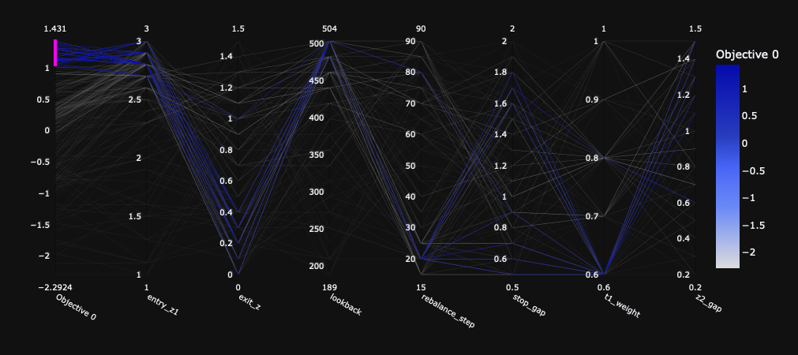
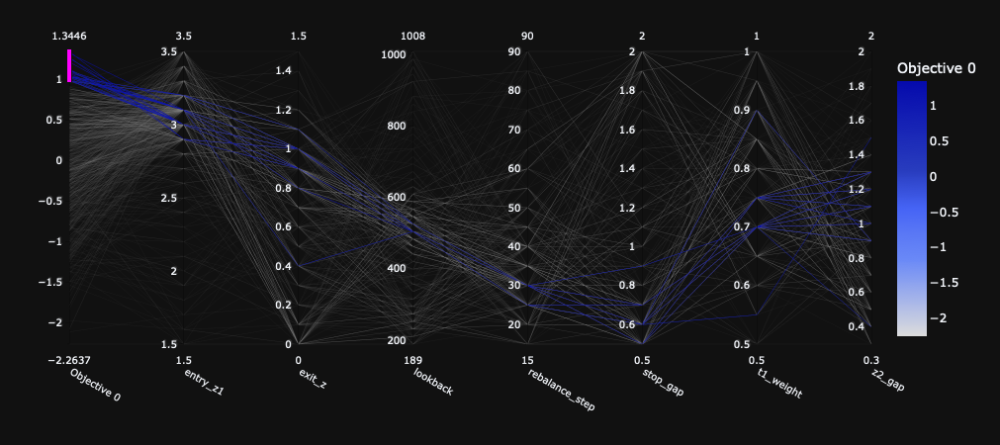
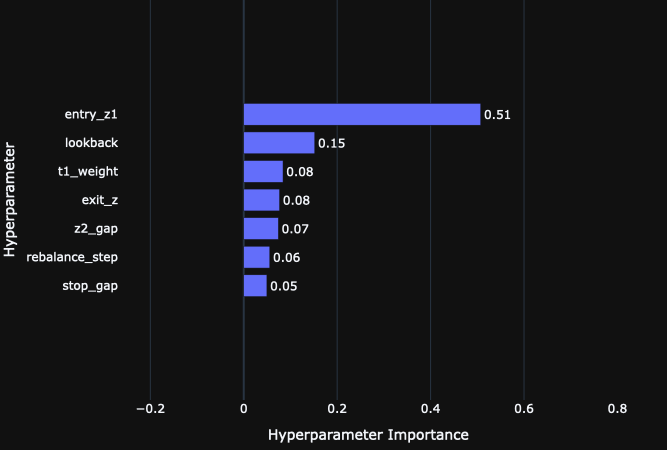
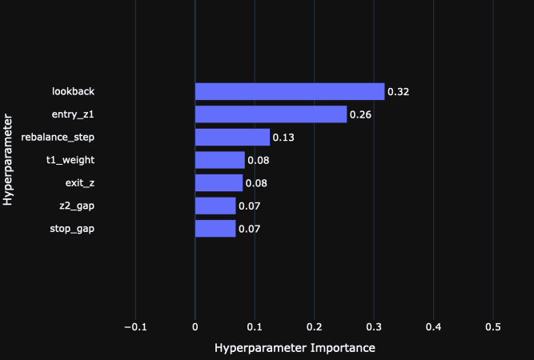
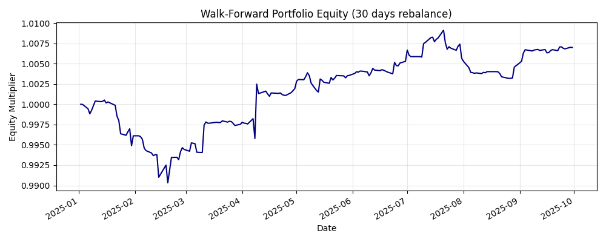
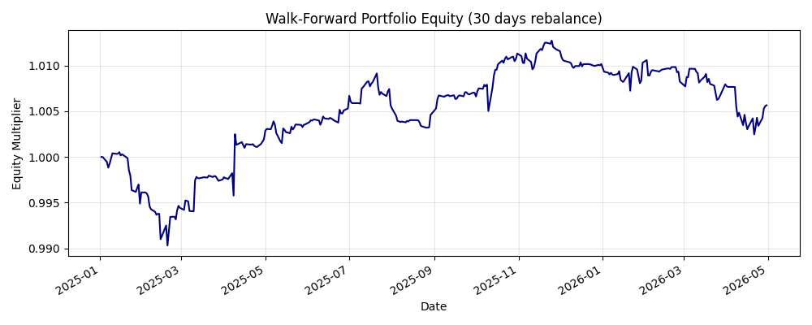

# Statistical Arbitrage Research System with Walk-Forward Optimization

> This project is an automated pairs trading system designed to find and trade stock relationships within the S&P 500. By using statistical tests to identify pairs of companies that naturally move together, the strategy automatically executes trades whenever their prices temporarily drift apart. To discover the best settings, the code runs a fast, multi-core optimization engine via Optuna that tests thousands of parameter combinations while aggressively filtering out high-risk setups. In the realistic out-of-sample testing, fully accounting for transaction fees, the system achieved a solid 0.71 Sharpe ratio and kept losses strictly capped at a -1.02% maximum drawdown. Ultimately, this framework provides a practical look at quantitative trading while capturing how a strategy's edge naturally decays over time as market conditions shift.

---

## Key Engineering & Quantitative Highlights

* **Strict Backtesting Hygiene:** Complete elimination of look-ahead bias through $T+1$ execution logic. Realistic PnL accounting based on total gross capital exposure, incorporating 5 bps transaction costs on turnover.
* **Advanced Statistical Filtering:** Pairs are dynamically grouped by GICS subsectors and filtered using **Engle-Granger Cointegration** ($p < 0.05$) and the **Hurst Exponent** ($H < 0.45$).
* **Dynamic Risk Management:** Rolling OLS for dynamic hedge ratios, combined with a Tranche System that scales into trades based on Z-score standard deviations while enforcing hard stop-losses.
* **High-Performance Optimization:** Implemented a multithreaded hyperparameter search via **Optuna**. Architected to spawn isolated CPU processes, completely bypassing the Python Global Interpreter Lock (GIL) for massive performance gains across 14 cores.
* **Drawdown-Penalized Objective Functions:** The optimization algorithm maximizes the Sharpe Ratio while strictly penalizing configurations that exceed a 10% maximum drawdown, ensuring robust, risk-adjusted returns rather than overfitted theoretical gains.

---

## Analytics, Visualizations & Hyperparameter Dimensionality

A critical phase of this research involved a multi-core optimization of the strategy's 7 parameters using Optuna. The analysis was conducted in two distinct phases after recognizing that the optimizer was aggressively clustering against the initial parameter ceilings.

### 1. The 7-Dimensional Optimization Landscape (Parallel Coordinates)

**Phase 1: Constrained Search Space** In the initial run, boundaries were conservatively set (e.g., `lookback` maxing out at 504 days, `entry_z1` at 3.0). The parallel coordinates plot revealed that the most profitable trials (dark blue) were crowding the absolute upper and lower limits of the search space.

>  
> *(Phase 1: Optimizer crowding the upper boundaries of `lookback` and `entry_z1` and lower boundary of `t1_weight`)*

**Phase 2: Expanded Parameter Boundaries** Recognizing the artificial constraint, I systematically widened the parameter space, stretching the `lookback` limit to 1008 days (4 years), `entry_z1` to 3.5, and `t1_weight`'s lower limit to 0.5. The updated landscape demonstrates a much healthier, centralized distribution of high-performing trials, proving the algorithm was finally able to locate the true global maxima rather than getting bottlenecked by arbitrary ceilings.

> 
> *(Phase 2: A stable, centralized distribution of high-performing parameter sets after boundary expansion)*

### 2. Feature Importance: What Actually Drives Alpha?

Expanding the boundaries didn't just yield better returns; it fundamentally changed the mechanics of the strategy. This is visible in the Hyperparameter Importance analysis (calculated via fANOVA / Random Forest feature importance).

* **Before Boundary Expansion:** The system was starved of historical context (capped at 504 days). To compensate, it over-relied on extreme entry thresholds to find profitability, giving `entry_z1` a massive **0.51** importance weighting.
> 

* **After Boundary Expansion:** Once the algorithm was allowed to analyze up to 4 years of data (`lookback` up to 1008), the structural memory of the cointegrated pair took precedence. **`lookback`** became the most critical factor (**0.32**), followed by **`entry_z1`** (**0.26**) and the **`rebalance_step`** (**0.13**). 
> 

By giving the Walk-Forward engine a longer memory (`lookback`) and the flexibility to rebalance at the right frequencies, the strategy shifted from relying purely on extreme standard deviation shocks to exploiting deeply ingrained, structural cointegration. Complex scaling mechanics (tranche weights, gaps) proved to be secondary risk-management tools rather than primary alpha drivers.

### 3. Out-Of-Sample Equity & The Reality of Alpha Decay

The final Walk-Forward Out-Of-Sample (OOS) equity curves visually prove the core thesis of this research: financial markets are non-stationary, and static models will inevitably decay. 

> 
> *(Phase 1: The model successfully identifies and exploits structural cointegration over a 9-month out-of-sample window, generating consistent, stable returns. Sharpe: 0.71, Max Drawdown: -1.02%)*

> 
> *(Phase 2: Zooming out to the 16-month view. After the initial run-up, the market regime shifts. The previously optimized statistical edge degrades, resulting in a slow, continuous drawdown. Sharpe: 0.35, Max Drawdown: -1.02%)*

The statistical cointegration that drove the strategy's profitability in the first window eventually broke down as the market regime, macroeconomic conditions, or sector correlations shifted.

---

## Insights

Building the code was the baseline; the true value of this project lies in the statistical insights derived from millions of simulated trading days. 

1. **Alpha Decay & Market Regimes:** There is no fixed winning formula in the financial markets. Parameters that generated exceptional risk-adjusted returns over a 24-month in-sample period frequently flattened out 6-8 months later. Continuous Walk-Forward Analysis and dynamic portfolio rebalancing are absolute necessities.
2. **Efficiency of the S&P 500:** Large-cap US equities are highly efficient. The market corrects inefficiencies rapidly, requiring highly sensitive tactical entries.
3. **Simplicity Over Complexity:** Adding complex scaling tranches had a negligible impact on top-line returns compared to simply optimizing the **Lookback Window** and the **Rebalance Frequency**. 
4. **Research Documentation:** I didn't heavily document the first 75% of the project. If I had written down my daily hypotheses and dead-ends from day one, my final statistical insights would have been even sharper. 

---

## Overview

* **`get_data.py`**: Scrapes live S&P 500 constituents via Wikipedia, maps GICS structures, and downloads historical price matrices via `yfinance`.
* **`find_pairs.py`**: The mathematical engine. Processes large correlation matrices, runs Engle-Granger tests, calculates Ornstein-Uhlenbeck Half-Life, and builds the valid trading universe.
* **`ols.py`**: The strategy class. Handles rolling OLS regressions, Z-score state tracking, signal generation, and realistic transaction-cost-adjusted PnL calculations.
* **`main.py`**: The Walk-Forward backtester. Iterates through time linearly, freezing historical data, building a portfolio, tracking OOS equity, and then stepping forward to re-evaluate the market.
* **`optimise.py`**: The multiprocessing optimization script. Uses Optuna SQL storage to distribute hyperparameter trials across isolated CPU workers.
